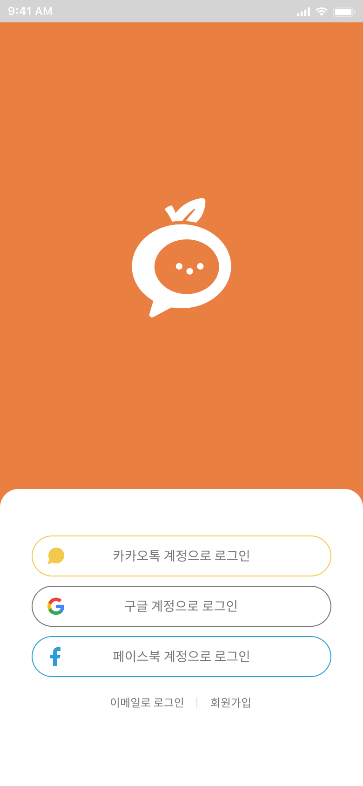
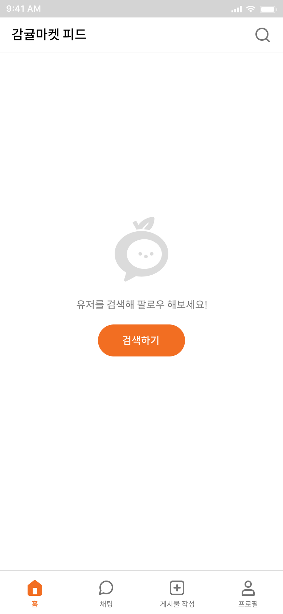
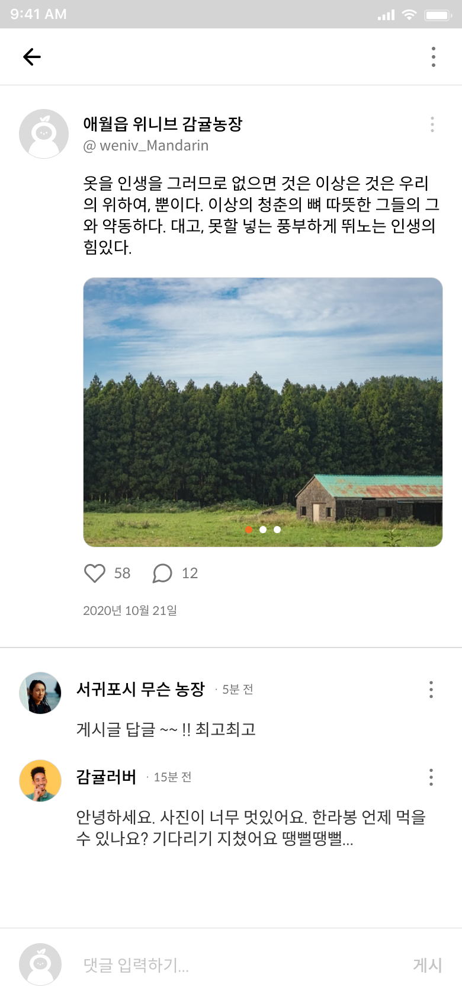
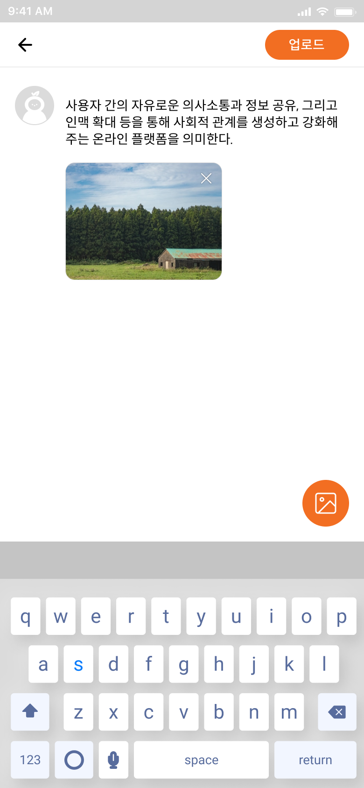
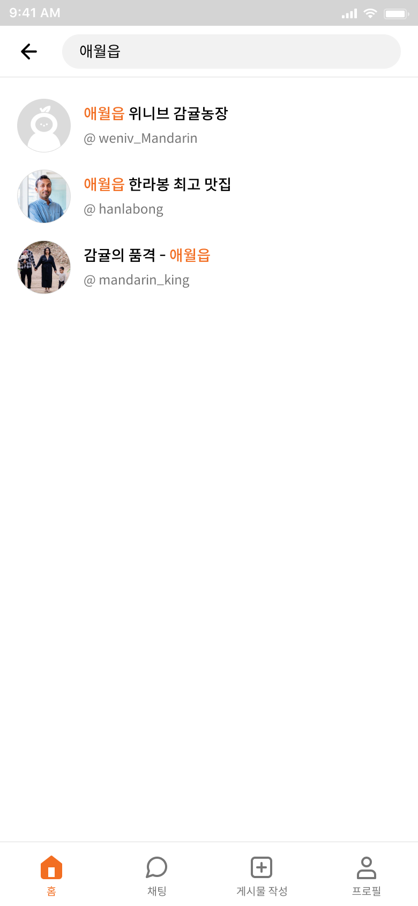
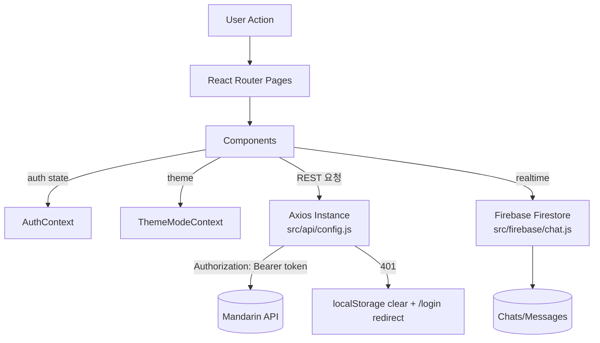

# 🍊 Mandarin Market (감귤마켓)


SNS형 피드 + 중고거래 + 실시간 채팅을 결합한 **모바일 퍼스트 웹 앱**입니다.  
게시글/상품 CRUD, 팔로우/검색, 그리고 **Firebase Firestore 기반 채팅(1:1/그룹/리액션/핀/테마)**을 제공합니다.

> **Design**: Mobile-first / max-width 390px  
> **API Base**: `https://dev.wenivops.co.kr/services/mandarin`  
> **AI Proxy**: `https://dev.wenivops.co.kr/services/openai-api`

---

## 목차
- [목표](#목표)
- [배포](#배포)
- [코드 품질 관리](#코드-품질-관리)
- [기술 스택](#기술-스택)
- [핵심 기능](#핵심-기능)
- [Screenshots](#screenshots)
- [Architecture](#architecture)
- [개발환경 및 실행](#개발환경-및-실행)
- [환경 변수](#환경-변수)
- [브랜치 전략](#브랜치-전략)
- [협업 프로세스](#협업-프로세스)
- [Commit Convention](#commit-convention)
- [URL 구조](#url-구조)
- [프로젝트 구조](#프로젝트-구조)
- [Troubleshooting](#troubleshooting)
- [추후 개발 사항](#추후-개발-사항)

---

## 목표

- **커뮤니티(피드) + 거래(상품) + 소통(채팅)**을 하나의 앱에서 제공
- 협업 기준에 맞는 **레이어 분리(UI / API / Context / Firebase)** 및 코드 컨벤션 적용
- 모바일 환경에서 사용성이 좋은 **Mobile-first UI** 구현

---

## 배포

- **배포 URL**: (추가 예정)
- **데모 계정**: (추가 예정)

---

## 코드 품질 관리

본 프로젝트는 **ESLint + Prettier**로 코드 품질을 관리합니다.

### Scripts
```bash
npm run dev           # 개발 서버
npm run build         # 프로덕션 빌드
npm run preview       # 빌드 프리뷰
npm run lint          # ESLint
npm run format        # Prettier 포맷
npm run format:check  # Prettier 체크
```

---

## 기술 스택

- **Frontend**: React 19, Vite
- **Routing**: React Router v7
- **Styling**: styled-components (theme 기반)
- **HTTP**: Axios (interceptor 기반 토큰 주입/401 처리)
- **Realtime Chat**: Firebase (Firestore, Analytics)
- **External API**: Weniv Mandarin API
- **AI**: Weniv OpenAI proxy (이미지 기반 상품명/설명 생성)

---

## 핵심 기능

### 인증/유저
- 회원가입/로그인
- `AuthContext`로 인증 상태 전역 관리
- 토큰 저장 및 사용자 정보 갱신

### 피드/게시글
- 게시글 CRUD
- 좋아요/댓글 CRUD
- 신고

### 상품
- 상품 CRUD
- 상품 정보 AI 자동 생성(이미지 입력 기반)

### 검색/팔로우
- 사용자 검색
- 팔로우/언팔로우 및 리스트

### 실시간 채팅(Firebase)
- 1:1 채팅 생성/구독
- 그룹 채팅 생성(제목/이미지)
- 메시지 전송(텍스트/이미지), 수정/삭제
- 리액션(heart/thumbs_up/star)
- 채팅 핀(pin), 채팅 테마 저장

---

## Screenshots

> 레포 `images/` 폴더의 스크린샷을 사용합니다.

| Splash | Login | Login (Email) |
|---|---|---|
|  |  |  |

| Feed(Home) | Post | Upload |
|---|---|---|
|  |  |  |

| Search | Chat List | Chat Room |
|---|---|---|
|  |  |  |

| Profile | Edit Profile | Edit Product |
|---|---|---|
|  |  |  |

---

## Architecture

### 1) High-level (Layered)
```text
UI (Pages/Components)
  ├─ Context (Auth / Theme)
  ├─ API Layer (Axios instance + domain modules)
  └─ Firebase Layer (Chat service)
```

### 2) Runtime Flow (Mermaid)


### 3) 핵심 설계 포인트
- **AuthContext**
  - 앱 마운트 시 `localStorage.token` 기반 사용자 검증
  - `login()` → token/accountname 저장, `logout()` → 스토리지 정리 및 상태 초기화
- **Axios Interceptor**
  - Request: Authorization 자동 첨부
  - Response: 401 발생 시 토큰 제거 + 로그인 페이지로 리다이렉트
- **Firebase Chat Service**
  - 채팅 생성/구독, 메시지 전송/수정/삭제, 리액션/핀/테마 등 채팅 도메인 로직 집중

---

## 개발환경 및 실행

### 요구사항
- Node.js (권장: LTS)

### 설치/실행
```bash
git clone https://github.com/Hallabong-Frontend/mandarin-market.git
cd mandarin-market
npm install
npm run dev
```

---

## 환경 변수

Firebase 기능 사용을 위해 `.env` 파일이 필요합니다. (`VITE_` prefix 필수)

```bash
VITE_FIREBASE_API_KEY=
VITE_FIREBASE_AUTH_DOMAIN=
VITE_FIREBASE_PROJECT_ID=
VITE_FIREBASE_STORAGE_BUCKET=
VITE_FIREBASE_MESSAGING_SENDER_ID=
VITE_FIREBASE_APP_ID=
VITE_FIREBASE_MEASUREMENT_ID=
```

---

## 브랜치 전략

Git Flow에 준하는 단순 전략을 사용합니다.

```text
main   ── 배포 브랜치
dev    ── 통합 개발 브랜치
feature/* ─ 기능 단위 브랜치
fix/*     ─ 긴급 버그 픽스 브랜치
```

브랜치 네이밍 예시
```text
feature/auth-login
feature/chat-reactions
feature/product-ai
fix/chat-scroll-bug
```

---

## 협업 프로세스

1. **Issue 생성**
   - 작업 범위는 “1 Issue = 1~2 기능(작게)” 기준
2. **feature 브랜치 생성**
```bash
git checkout dev
git pull origin dev
git checkout -b feature/작업이름
```
3. **개발 & 자체 점검**
   - `npm run lint`, `npm run format:check`
4. **PR 생성 → 코드리뷰 → Merge**
   - PR 템플릿(권장)
     - 무엇을/왜/어떻게
     - 스크린샷(가능하면)
     - 체크리스트(린트/포맷/동작 확인)

---

## Commit Convention

Conventional Commit 기반을 권장합니다.

```text
feat: 기능 추가
fix: 버그 수정
refactor: 리팩토링
style: 스타일/포맷(로직 변경 없음)
docs: 문서 수정
chore: 설정/빌드/의존성
```

예시
```text
feat: add firebase group chat creation
fix: prevent duplicate send on enter
refactor: extract axios error handler
docs: update README screenshots section
```

---

## URL 구조

> 실제 라우트는 `App.jsx` 기준으로 관리합니다.

대표 라우트(예시)
```text
/                     Splash
/login                로그인 메인
/login/email          이메일 로그인
/signup               회원가입
/signup/profile        프로필 설정
/feed                 피드
/search               사용자 검색
/profile/:accountname 프로필
/post/:postId          게시글 상세
/product/register      상품 등록
/product/edit/:id      상품 수정
/chat                 채팅 목록
/chat/:chatId          채팅방
```

---

## 프로젝트 구조

```text
src/
  api/          # auth/user/post/comment/product/ai
  assets/       # 아이콘/이미지(정적 리소스)
  components/   # common + domain components
  constants/    # url/common constants
  context/      # AuthContext, ThemeModeContext
  firebase/     # firebase config + chat service
  hooks/        # useForm 등
  pages/        # route pages
  styles/       # GlobalStyles/theme
  utils/        # format, validation, image url helpers
  App.jsx
  main.jsx
```

---

## Troubleshooting

### 1) `npm` 실행이 PowerShell에서 막히는 경우
- 증상: `npm : 이 시스템에서 스크립트를 실행할 수 없으므로 ... npm.ps1 ...`
- 해결: PowerShell 실행 정책을 변경하거나, Git Bash/WSL 터미널 사용  
  (팀 공통 문서에 OS별 해결 가이드를 추가 권장)

### 2) 채팅이 동작하지 않는 경우
- 원인: `.env` 누락 또는 Firebase 프로젝트 설정값 불일치
- 해결: `.env` 설정 후 재실행 (`npm run dev`)

### 3) API 요청이 401로 떨어지는 경우
- 원인: 토큰 만료/유효하지 않은 토큰
- 해결: 로그아웃 후 재로그인 (인터셉터가 자동으로 `/login` 리다이렉트)

---

## 추후 개발 사항

- [ ] 배포 URL/데모 계정/소개 영상(GIF) README에 추가
- [ ] 테스트 도입 (예: Vitest + React Testing Library)
- [ ] CI (GitHub Actions)로 lint/format 체크 자동화
- [ ] 채팅 성능 개선(무한 스크롤/페이지네이션)
- [ ] 접근성 개선(키보드 포커스/ARIA)

---